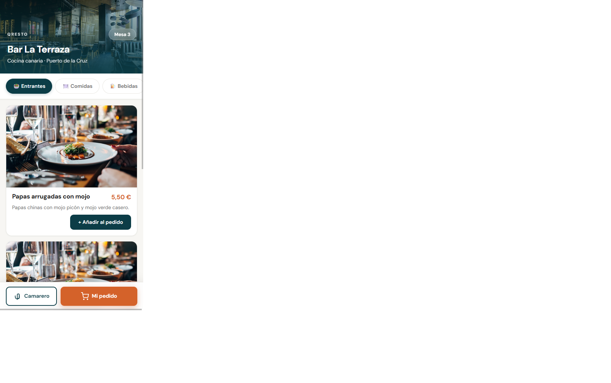
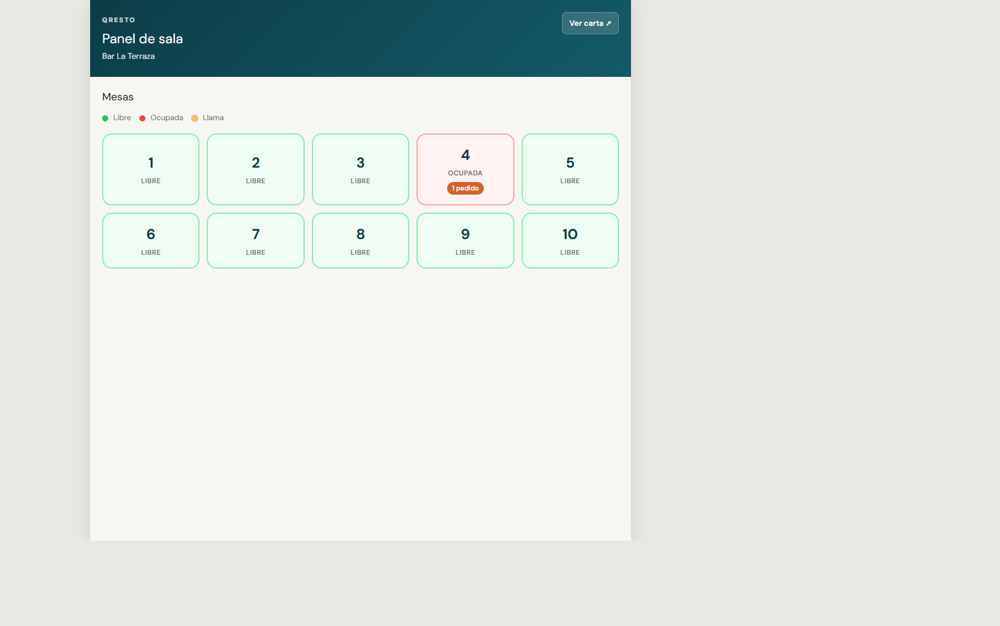
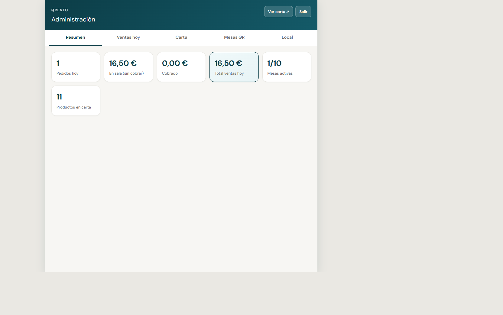
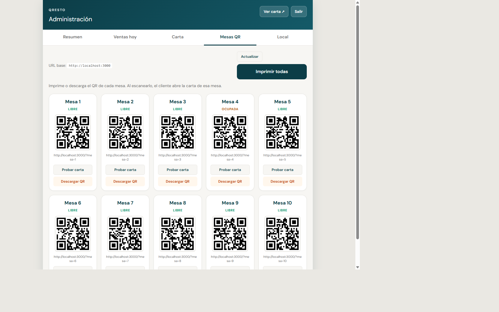

# QResto

SaaS para **bares y restaurantes** en Canarias: carta digital por QR, pedidos en tiempo real y panel de administración.

**Demo local:** `npm start` → http://localhost:3000  
**Repositorio:** https://github.com/Adonay86/QResto  
**Historial de cambios:** [docs/historial-cambios.md](docs/historial-cambios.md)

---

## Capturas

### Carta del cliente (móvil)
El cliente escanea el QR de su mesa y pide desde el móvil.



### Panel camarero
Mesas en vivo, pedidos y cobros con Socket.io.



### Panel admin
Resumen del día, ventas con historial por fecha, carta editable y códigos QR por mesa.





---

## Qué hace

| Pantalla | Usuario | Función |
|----------|---------|---------|
| **Carta** `/?mesa=N` | Cliente | Menú, carrito, pedido, llamar camarero, **opciones de bebida** |
| **Camarero** | Sala | Mesas en tiempo real, servir y cobrar (ve opciones del pedido) |
| **Admin** | Dueño | Carta, local, camareros, **ventas por día (calendario)**, QR por mesa |

### Destacados recientes
- **Opciones de bebida:** el admin activa el check en el producto; el cliente elige Fría / Natural / Con hielo / Con limón.
- **Historial de ventas:** cada jornada se guarda; en admin se consulta con calendario y chips de días.
- **Camareros:** login por usuario + contraseña; gestión desde admin.

## Stack

JavaScript · Node.js · Express · Socket.io · MySQL (opcional) · Tailwind CSS

## Arranque rápido

```bash
cd server && npm install
cd ../client && npm install && npm run build:css
cd ../server && npm start
```

| URL | Descripción |
|-----|-------------|
| http://localhost:3000/?mesa=3 | Carta cliente |
| http://localhost:3000/camarero.html | Panel camarero |
| http://localhost:3000/admin.html | Panel admin (contraseña en `.env`) |

## Variables de entorno

Copia `server/.env.example` → `server/.env`:

| Variable | Descripción |
|----------|-------------|
| `PORT` | Puerto del servidor (3000) |
| `QRESTO_ADMIN_PASSWORD` | Clave panel admin |
| `QRESTO_CAMARERO_PASSWORD` | Clave panel camarero (legacy; preferir usuarios en admin) |
| `QRESTO_BASE_URL` | URL pública para QR en producción |
| `MYSQL_*` | MySQL opcional |

## Estructura

```
QResto/
├── client/              # Carta, camarero, admin
├── server/              # API REST + Socket.io
│   └── data/
│       ├── carta-demo.json
│       ├── camareros.json
│       └── ventas/      # Un JSON por día (YYYY-MM-DD.json)
├── docs/                # Planificación, capturas, historial de cambios
└── README.md
```

## API principal

| Método | Ruta | Auth |
|--------|------|------|
| GET | `/api/carta` | — |
| POST | `/api/pedidos` | — |
| GET | `/api/estado` | — |
| POST | `/api/camarero/login` | — |
| GET | `/api/admin/mesas-qr` | Admin |
| GET | `/api/admin/ventas-hoy` | Admin |
| GET | `/api/admin/ventas?fecha=YYYY-MM-DD` | Admin |
| GET | `/api/admin/ventas/dias` | Admin |
| GET | `/api/admin/camareros` | Admin |
| POST | `/api/admin/camareros` | Admin |
| PUT | `/api/admin/camareros/:id` | Admin |
| DELETE | `/api/admin/camareros/:id` | Admin |

Evento Socket.io: `estado:actualizado`

## Autor

**Carlos Adonay Gómez González** — Desarrollador web · Las Palmas de Gran Canaria  
📧 Adonaygomez27@gmail.com · [GitHub](https://github.com/Adonay86/QResto)

## Licencia

Proyecto de portfolio / producto en desarrollo.
